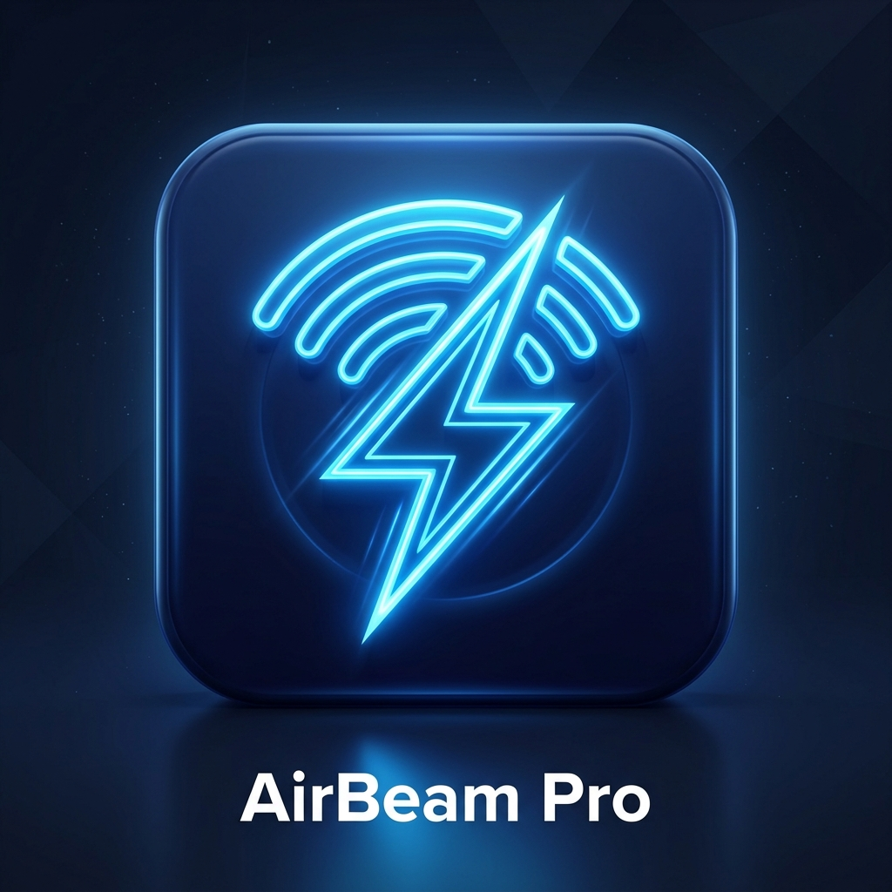

# ⚡ AirBeam Pro Mobile

> **AirBeam Pro Mobile App** is a high-speed, serverless P2P offline file sharing application designed for mobile devices (Android, iOS, and Mobile Web PWA). Send and receive photos, videos, and large files up to 1GB+ directly between phones over WebRTC.



---

## 🌟 Key Features

* **⚡ Pure WebRTC P2P Transfer**: Direct device-to-device streaming without third-party servers.
* **📱 Native Mobile Experience**: Touch haptics, bottom sheet layout, safe-area inset support, and native file share sheet integration.
* **📶 Offline Hotspot Support**: Works over local Mobile Hotspots & Wi-Fi networks without consuming cellular internet data.
* **💾 Sequential Storage Engine**: Powered by IndexedDB batch chunking to handle files up to 1GB+ smoothly without memory crashes.
* **🔑 Fast 4-Digit PIN Pairing**: Pair devices in seconds with simple numeric PINs.
* **📱 Cross-Platform Support**: Native Android APK (via Capacitor) or PWA standalone mobile web app.

---

## 🚀 Getting Started

### 1. Web & Local Development
Run a local dev server:
```bash
npx serve .
# or
powershell -ExecutionPolicy Bypass -File server.ps1
```
Open `http://localhost:8080` in your browser.

---

## 📱 Building the Native Android APK

### Requirements
* **Node.js**: v18+
* **Android Studio**: Latest release (with Android SDK 33+)

### Build Steps

1. **Install Dependencies**:
   ```bash
   npm install
   ```

2. **Initialize & Sync Capacitor Android**:
   ```bash
   npx cap add android
   npx cap sync
   ```

3. **Open in Android Studio**:
   ```bash
   npx cap open android
   ```

4. **Build APK**:
   * Inside Android Studio, go to **Build** -> **Build Bundle(s) / APK(s)** -> **Build APK(s)**.
   * Locate the generated `app-debug.apk` in `android/app/build/outputs/apk/debug/`.

---

## 🌐 Live Web PWA Installation

You can install AirBeam Pro directly on any Android device or iPhone:
1. Open the web app URL in Chrome / Safari.
2. Tap **Menu** (⋮) -> **Add to Home Screen** / **Install App**.

---

## 📄 License

Created by [Shader7 (Nishikant Xalxo)](https://github.com/shaderindia).
Licensed under the [MIT License](LICENSE).
